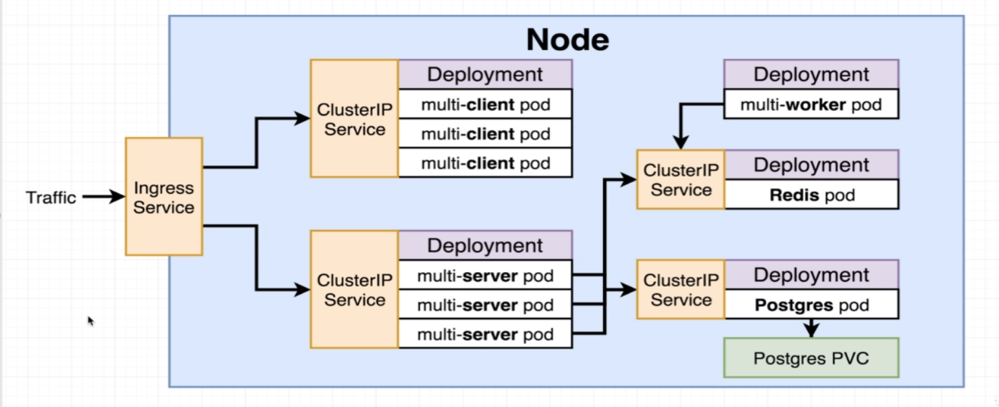

# The Path to Production
  
We will loook more into Ingress Service, ClusterIp Service and Postgres PVC(Persistent Volume Claim).  
Path to production.  
1. Create config files for each service and deployment.  
2. Test locally on minikube.  
3. Create a Github/Travis flow to build images and deploy.  
Deploy app to a cloud provider.  

### Rebuild the images to check that everything is working
1. cd into the folder.  
2. ```docker-compose up --build```  
3. Remember first time you run it there is a change that it will break. Run docker-compose up again.  
4. Go to localhost:3050  
