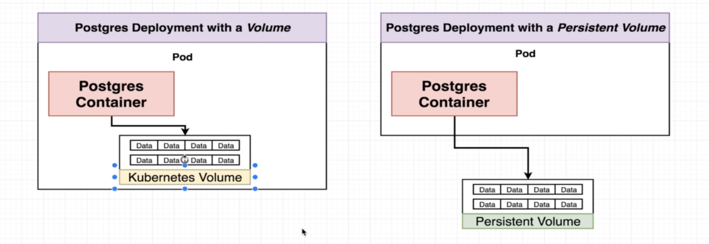

# Volumes vs Persistent Volumes
With a persistent volume we are creating a long term durable storage that is not thiged to any specific pod or any specific container.  
So you can imagine that it's outside the pod.  
If the container or the pod crashes the persistent will still be there.  

  
