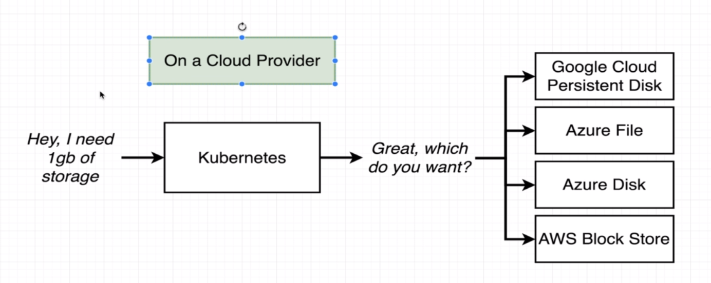

# Where Does Kubernetes Allocate Persistent Volumes?
Kubernetes makes a slice of your harddrive that is going to be a persistent volume.  
```kubectl get storageclass``` # See the options Kubernetes has for creating a persistent volume.  
```kubectl describe storageclass``` # For more information.  
### On a cloud provider
In a cloud there are many options to store and you have to tell Kubernetes which option you want to use.  
Check storage classes. Scroll down to provisioner here https://kubernetes.io/docs/concepts/storage/storage-classes/  
In Azure there is set up a default for you.  
If you don't specify one the it's using the default else you have to specify a ```storageClassName```.  

  
